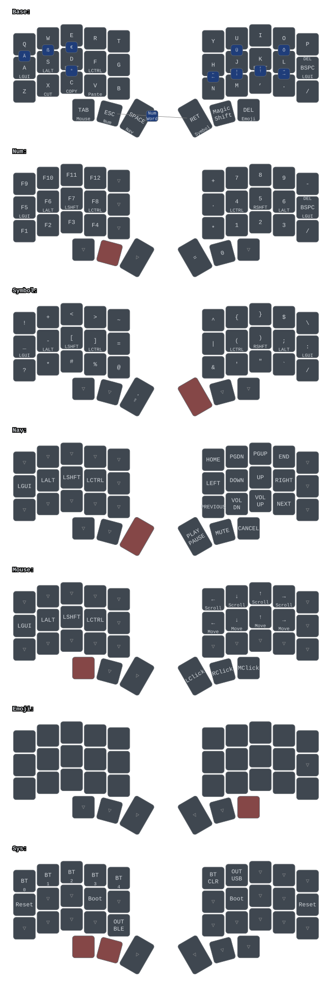

# zmk-config

ZMK firmware config for two split keyboards:
- **Lily58** (58 keys)
- **Corne Mini** (36 keys, with displays)

Shared keymap logic lives in `config/base.keymap` (5×3+3 core). Board-specific files include and wrap it.

## Keymap



## Building locally

Requires Docker.

```sh
# First run — initializes the west workspace and fetches dependencies (~1GB, takes a while):
docker compose run --rm lily58-left

# Subsequent builds are fast:
docker compose run --rm lily58-left
docker compose run --rm lily58-right

# Corne
docker compose run --rm corne-left
docker compose run --rm corne-right
```

Output `.uf2` files are written to `firmware/`.

After changing `config/west.yml` (e.g. adding a module), re-run:

```sh
docker compose run --rm west-update
```

The west workspace is cached in `.docker-west/` and persists between runs. Delete it to start fresh.

## Building via GitHub Actions

Push to `main` or open a PR to trigger a build. Firmware artifacts are available in the Actions tab.

## Acknowledgements

Large parts of this config are based on [this amazing ZMK config](https://github.com/urob/zmk-config). Thanks urob!

The keymap diagram is generated with [keymap-drawer](https://github.com/caksoylar/keymap-drawer).
